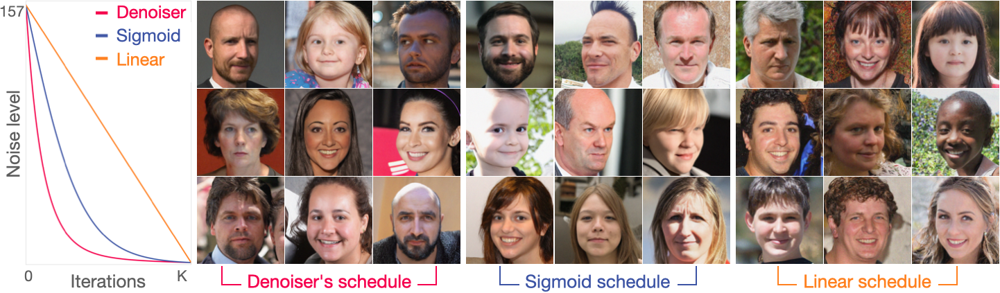

# Random Walks with Tweedie: A Unified Framework for Diffusion Models

<!--  -->
<!--  -->
<!--


-->

## Abstract
We present a simple template for designing generative diffusion model algorithms based on an interpretation of diffusion sampling as a sequence of random walks.
Score-based diffusion models are widely used to generate high-quality images.
Diffusion models have also been shown to yield state-of-the-art performance in many inverse problems.
While these algorithms are often surprisingly simple,
the theory behind them is not,
and multiple complex theoretical justifications exist in the literature.
Here,
we provide a simple and largely self-contained theoretical justification
for score-based-diffusion models
that avoids using the theory of Markov chains or reverse diffusion,
instead centering the theory of random walks and Tweedie's formula.
This approach leads to unified algorithmic templates for network training and sampling.
In particular, these templates cleanly separate training from sampling,
e.g., the noise schedule used during training need not match the one used during sampling.
We show that several existing diffusion models correspond to particular choices within this template
and demonstrate that other, more straightforward algorithmic choices
lead to effective diffusion models.
The proposed framework has the added benefit of enabling conditional sampling without any likelihood approximation.



## Environment setting

### 1) Clone the repository
```
git clone https://github.com/wustl-cig/randomwalk_diffusion

cd randomwalk_diffusion
```

### 2) Download Pretrained Score Function

- Download **variance-preserving score neural network** trained on the FFHQ 256x256 dataset [Pretrained VP score link](https://drive.google.com/drive/folders/1jElnRoFv7b31fG0v6pTSQkelbSX3xGZh). The default save directory is `./pretrained_models`.
- Download **variance-exploding score neural network** trained on the FFHQ 256x256 dataset [Pretrained VE score link](https://drive.google.com/drive/folders/1-2tUJ3tOU2AruyMYPB33x1aWVOQMSygM). The default save directory is `./pretrained_models`.


### 3) Virtual environment setup
```
conda create -n Randomwalk python=3.9.19

conda activate Randomwalk

pip install -r requirements.txt
```

## Run experiment

### 1) Pick one task from `configs` directory:

#### Unconditional image sampling

- **VP-score based**:
  - `configs/vp_uncond_sigmoidSchedule.yaml`
  - `configs/vp_uncond_pretrainedSchedule.yaml`

- **VE-score based**:
  - `configs/ve_uncond.yaml`

#### Conditional image sampling (Solving inverse problems)

- **VP-score based**:
  - `configs/vp_super_resolution.yaml`
  - `configs/vp_inpainting.yaml`

- **VE-score based**:
  - `configs/ve_super_resolution.yaml`
  - `configs/ve_inpainting.yaml`


### 2) Open `yaml` file and customize `# CUSTOMIZE`

```
# Open up the yaml file that you want to run experiment
vim {TASK_YAML_FILE_NAME}.yaml

# Only care the line that has `# Attention #`
gpu:  # CUSTOMIZE 1
pretrained_check_point:  # CUSTOMIZE 2
```

### 3) Execute the code
```
python3 sample.py --diffusion_config configs/{TASK_YAML_FILE_NAME}.yaml    # example code: python3 sample.py --diffusion_config configs/vp_uncond_pretrainedSchedule.yaml
```

## Implementation detail

```
sample.py                       # Read yaml file
│   
├────────── vp_langevin.py      # all operations of variance-exploding-based Langevin dynamics
│   
└────────── ve_langevin.py      # all operations of variance-exploding-based Langevin dynamics
```

<!--
## Implementation detail

- **`sample.py`**: This Python file reads the user's task configuration file path and performs the necessary setup for the desired experiment.

- **`guided_diffusion/gaussian_diffusion.py`**: This file is where all VP-related computations are done. Please check out function `vp_langevin_sampling`.

- **`score_sde_inverse/score_inverse/sampling/ve_sampler.py`**: This file is where all VE-related computations are done. Please check out function `ve_langevin_sampling` and `ve_sampler` for implementation detail.
-->

## Code references

We partially adapt variance-preserving code structure from [DPS repo](https://github.com/DPS2022/diffusion-posterior-sampling?tab=readme-ov-file) and [guided_diffusion repo](https://github.com/openai/guided-diffusion).

We partially adapt the variance-exploding code structure from [score_sde_pytorch repo](https://github.com/yang-song/score_sde_pytorch) and [score-sde-inverse repo](https://github.com/andylolu2/score-sde-inverse).

## Citation

```
@article{park2024randomwalks,
	  title={Random Walks with Tweedie: A Unified Framework for Diffusion Models},
	  author={Park, Chicago Y.
		and McCann, Michael T.
		and Garcia-Cardona, Cristina
		and Wohlberg, Brendt
		and Kamilov, Ulugbek S.},
	  journal={arXiv preprint arXiv:2411.18702},
	  year={2024}
	}
```

