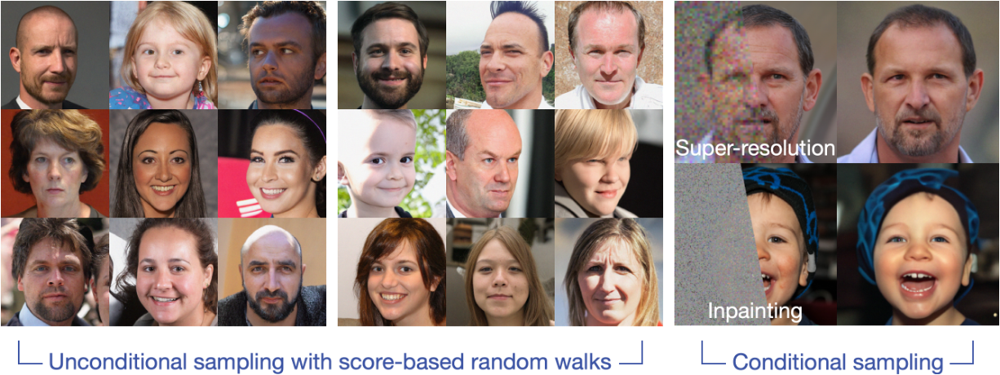

# [Random Walks with Tweedie: A Unified View of Score-Based Diffusion Models](https://arxiv.org/abs/2411.18702)

[[arXiv]](https://arxiv.org/abs/2411.18702)

<!--  -->
<!--  -->
<!--


-->


## Abstract
We present a concise derivation for several influential score-based diffusion models
that relies on only a few textbook results.
Diffusion models have recently emerged as powerful tools for generating realistic, synthetic signals --- %
particularly natural images --- %
and often play a role in state-of-the-art algorithms for inverse problems in image processing.
While these algorithms are often surprisingly simple,
the theory behind them is not,
and multiple complex theoretical justifications exist in the literature.
Here,
we provide a simple and largely self-contained theoretical justification
for score-based diffusion models that is targeted towards the signal processing community.
This approach leads to generic algorithmic templates for training and generating samples with diffusion models.
We show that several influential diffusion models correspond to particular choices within these templates and demonstrate that alternative, more straightforward algorithmic choices can provide comparable results.
This approach has the added benefit of enabling conditional sampling without any likelihood approximation.


## Environment setting

### 1) Clone the repository
```
git clone https://github.com/wustl-cig/randomwalk_diffusion

cd randomwalk_diffusion
```

### 2) Download Pretrained Score Function

- Download **variance-preserving score neural network** trained on the FFHQ 256x256 dataset [Pretrained VP score link](https://drive.google.com/drive/folders/1jElnRoFv7b31fG0v6pTSQkelbSX3xGZh). The default save directory is `./pretrained_models`.
- Download **variance-exploding score neural network** trained on the FFHQ 256x256 dataset [Pretrained VE score link](https://drive.google.com/drive/folders/1-2tUJ3tOU2AruyMYPB33x1aWVOQMSygM). The default save directory is `./pretrained_models`.


### 3) Virtual environment setup
```
conda create -n Randomwalk python=3.9.19

conda activate Randomwalk

conda install -c conda-forge mpi4py mpich

pip install -r requirements.txt
```

## Run experiment

### 1) Pick one task from `configs` directory:

#### Unconditional image sampling

- **VP-score based**:
  - `configs/vp_uncond_sigmoidSchedule.yaml`
  - `configs/vp_uncond_pretrainedSchedule.yaml`

- **VE-score based**:
  - `configs/ve_uncond.yaml`

#### Conditional image sampling (Solving inverse problems)

- **VP-score based**:
  - `configs/vp_super_resolution.yaml`
  - `configs/vp_inpainting.yaml`

- **VE-score based**:
  - `configs/ve_super_resolution.yaml`
  - `configs/ve_inpainting.yaml`


### 2) Open `yaml` file and customize `# CUSTOMIZE`

```
# Open up the yaml file that you want to run experiment
vim {TASK_YAML_FILE_NAME}.yaml

# Only care the line that has `# Attention #`
gpu:  # CUSTOMIZE 1
pretrained_check_point:  # CUSTOMIZE 2
```

### 3) Execute the code
```
python3 sample.py --diffusion_config configs/{TASK_YAML_FILE_NAME}.yaml    # example code: python3 sample.py --diffusion_config configs/vp_uncond_pretrainedSchedule.yaml
```

## Implementation detail

```
sample.py                       # Read yaml file
│   
├────────── vp_langevin.py      # all operations of variance-preserving-based Langevin dynamics
│   
└────────── ve_langevin.py      # all operations of variance-exploding-based Langevin dynamics
```

<!--
## Implementation detail

- **`sample.py`**: This Python file reads the user's task configuration file path and performs the necessary setup for the desired experiment.

- **`guided_diffusion/gaussian_diffusion.py`**: This file is where all VP-related computations are done. Please check out function `vp_langevin_sampling`.

- **`score_sde_inverse/score_inverse/sampling/ve_sampler.py`**: This file is where all VE-related computations are done. Please check out function `ve_langevin_sampling` and `ve_sampler` for implementation detail.
-->

<h2 style="color:red;">Troubleshooting</h2>

```diff
! If you encounter any issues, feel free to reach out via email at chicago@wustl.edu. 
```


## Code references

We partially adapt variance-preserving code structure from [DPS repo](https://github.com/DPS2022/diffusion-posterior-sampling?tab=readme-ov-file) and [guided_diffusion repo](https://github.com/openai/guided-diffusion).

We partially adapt the variance-exploding code structure from [score_sde_pytorch repo](https://github.com/yang-song/score_sde_pytorch) and [score-sde-inverse repo](https://github.com/andylolu2/score-sde-inverse).

## Citation

```
@article{park2025randomwalks,
	  title={Random Walks with Tweedie: A Unified View of Score-Based Diffusion Models},
	  author={Park, Chicago Y.
		and McCann, Michael T.
		and Garcia-Cardona, Cristina
		and Wohlberg, Brendt
		and Kamilov, Ulugbek S.},
	  journal={IEEE Signal Processing Magazine},
	  year={2025}
	}
```

